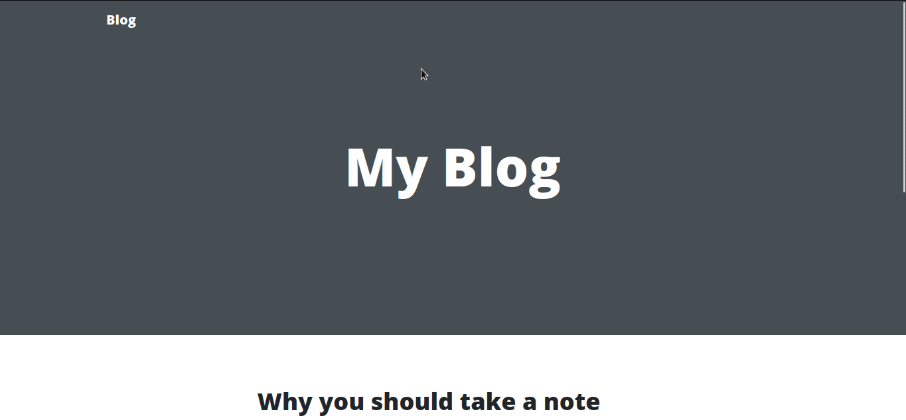

# jangmading
Simple Blog with Django Framework  

Django Admin credentials 
admin:djangojangjang1 

### How to install

`git clone https://github.com/redshamn12/jangmading.git`

### Install the requirements

`pip install -r requirements.txt`
